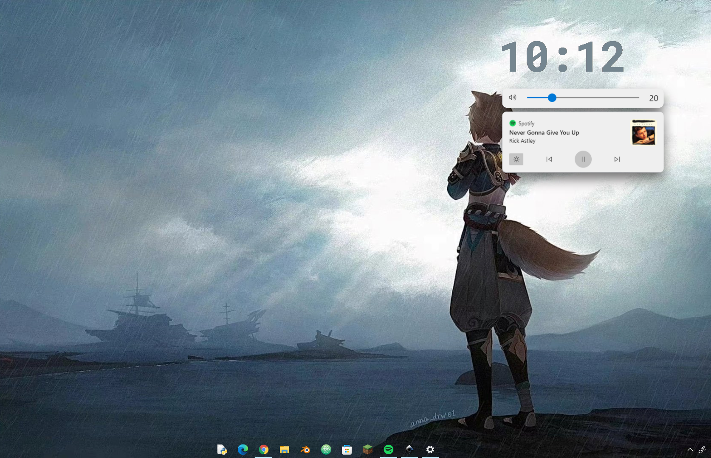

# Simplest Desktop Clock

The simplest possible customizable desktop clock 😎 made with python

What it does:
- It's a desktop clock
- It changes colors with your wallpaper

The best part is, it's customizable! So have fun!

## Install
To install the program, simply download the project, navigate to the folder, and run `install.bat`.

To remove the clock just navigate to the folder and run `uninstall.bat`. Don't forget to restard your computer after uninstalling it for the changes to take place.

## Customizing your clock
After installing you can customize your clock by running `customize.bat` at any time, or do it manually by changing values in `custom.py`.
#### Themes
Find premade themes for your clock in the `themes` folder. Run any of these to set the clock's theme. You can find the default theme at `themes/defaults.bat`.

Make a theme by running `theme.bat`; you will be able to find custom themes in the `themes` folder.

Have fun!

> Other apps I used in the example: TranslucentTB, [Modern Flyouts](https://modernflyouts-community.github.io/); theme is Roboto
